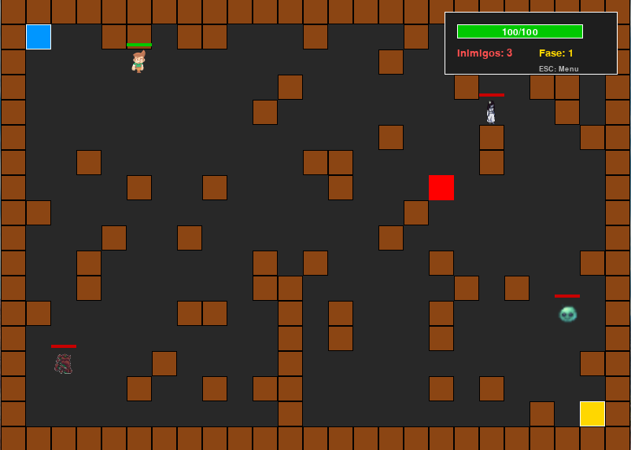

# O Labirinto Místico - Jogo Roguelike



## Descrição

**O Labirinto Místico** é um jogo roguelike desenvolvido em Python usando a biblioteca PgZero. O jogador controla um explorador arcano que deve navegar por um labirinto gerado proceduralmente, enfrentando diferentes tipos de inimigos mágicos e usando bombas para sobreviver.

---

## Características do Jogo

- **Roguelike** com visão de cima
- Labirinto gerado proceduralmente a cada partida
- Movimento baseado em grid com animações suaves de sprites
- Menu principal com botões interativos (controle principal pelo mouse)
- Três tipos de inimigos, cada um com IA e características próprias
- Sistema de fases infinitas e dificuldade progressiva
- Plantio e explosão de bombas para abrir caminhos e derrotar inimigos
- Música de fundo e efeitos sonoros customizados
- Interface visual com barra de vida, HUD e feedback ao jogador

---

## Controles

- **Mouse**: Principal forma de interação (movimentação, plantar bomba, botões do menu)
- **ESC**: Voltar ao menu principal

---

## Objetivo do Jogo

Explore o labirinto místico, evite ou derrote inimigos mágicos e sobreviva. O jogo termina quando a vida do herói chega a zero ou chegar à porta de saída, um novo labirinto é gerado automaticamente, com dificuldade crescente.

---

## Estrutura do Código

O código está organizado em classes bem definidas:

- `SpriteAnimation`: Gerencia animações de sprites
- `Hero`: Controla o personagem principal
- `Enemy`: Gerencia inimigos e sua IA
- `Dungeon`: Gera e renderiza o labirinto
- `Button`: Interface de botões do menu
- `Bomb`: Lógica das bombas e explosões

O jogo segue o padrão de game loop do PgZero com funções `update(dt)` e `draw()` para lógica e renderização.

---

## Instalação e Execução

### Pré-requisitos

- **Python 3.7+** instalado
- **PgZero** instalado via pip

### Instalação

```bash
pip install pgzero
```

### Estrutura de Arquivos

```
projeto/
├── game.py              # Código principal do jogo
├── README.md            # Esta documentação
├── sounds/
│   ├── background_music.ogg
│   ├── hover_sound.ogg
│   ├── prepare_yourself.ogg
│   ├── you_win.ogg
│   └── you_lose.ogg
├── music/
│   └── background_music.ogg
├── images/
│   ├── hero_idle0.png
│   ├── hero_idle1.png
│   ├── hero_walk_right0.png
│   ├── hero_walk_right1.png
│   ├── hero_walk_left0.png
│   ├── hero_walk_left1.png
│   ├── hero_victory0.png
│   ├── hero_victory1.png
│   ├── slime_idle0.png
│   ├── slime_idle1.png
│   ├── slime_walk_right0.png
│   ├── slime_walk_right1.png
│   ├── slime_walk_left0.png
│   ├── slime_walk_left1.png
│   ├── golem_idle0.png
│   ├── golem_idle1.png
│   ├── golem_walk_right0.png
│   ├── golem_walk_right1.png
│   ├── golem_walk_left0.png
│   ├── golem_walk_left1.png
│   ├── specter_idle0.png
│   ├── specter_idle1.png
│   ├── specter_walk_right0.png
│   ├── specter_walk_right1.png
│   ├── specter_walk_left0.png
│   └── specter_walk_left1.png
```

### Executando o Jogo

```bash
pgzrun game.py
```

Ou, se preferir:

```bash
python -m pgzero game.py
```

---

## Solução de Problemas

- **Problemas de áudio no Linux:**  
  Execute com:  
  `SDL_AUDIODRIVER=dummy pgzrun game.py`

- **PgZero não encontrado:**  
  Adicione ao PATH:  
  `export PATH=$PATH:~/.local/bin`

- **Problemas de permissão:**  
  Use:  
  `pip install --user pgzero`

---

## Notas de Desenvolvimento

- O código segue princípios de orientação a objetos e PEP8.
- Toda a lógica, animação e IA são implementadas em classes próprias.
- O projeto é único e foi escrito de forma independente para fins educacionais.

---

## Créditos

- **Música de fundo:** "Triumphant (Long)" por Good_B_Music (Pixabay)
- **Efeitos sonoros:** "background_music", "hover_sound", "explosion", "prepare_yourself", "you_win", "you_lose". (Pixabay)
- **Sprites:** Customizados ou adaptados para este projeto

---

**Desenvolvido por:** Cássio Schardosim  
**Data:** Junho 2025

